Sequence Analysis: Time Use Data (ATUS)
================
Kamila Kolpashnikova[1]

## Introduction

Traditionally, a tool for analysing life events in social sciences,
sequence analysis is becoming more and more popular for dealing with
time-use data. In this tutorial, I’ll walk you through the steps how to
do sequence analysis with time-use data (American Time Use Survey,
ATUS).

To follow this tutotial:

-   change the directory to the location of the cloned directory
-   follow instructions in the code (R file is included)

Funding: This project has received funding from the European Union’s
Horizon 2020 research and innovation programme under the Marie
Sklodowska-Curie grant agreement No 892101 (awardee: Kamila
Kolpashnikova).

## Example of Work Using Sequence Analysis

I published a paper using sequence analysis in the Journal of Population
Ageing:

Kolpashnikova, K., & Kan, M. Y. (2020). [Eldercare in Japan: Cluster
Analysis of daily time-use patterns of elder
caregivers](https://link.springer.com/article/10.1007/s12062-020-09313-3?error=cookies_not_supported&error=cookies_not_supported&code=c96bbaf5-07eb-44f1-9b06-c3d57d3d955b&code=7b332393-7ea9-4da9-b007-2b13cb44cf73).
Journal of Population Ageing, 1-23.

If you follow this tutorial, you will be able to recreate the analyses
in the paper.

## Loading Necessary Packages

``` r
#### Loading Necessary Packages ####
if (!require("pacman")) install.packages("pacman")
```

    ## Loading required package: pacman

``` r
library(pacman)

# load and install packages
pacman::p_load(TraMineR, TraMineRextras, downloader, cluster, RColorBrewer, devtools, haven, 
               tidyverse, reshape2, WeightedCluster, nnet, plyr)
```

## Load Datasets from the BLS website

Remember that in r, it’s forward slashes. Here I created a function that
can unzip and create dataframes from the zipped BLS ATUS files.

``` r
#' Download, unzip, and create a dataframe from ATUS files. Note: the zipped file will be downloaded as "data" in your working directory.
#' 
#' @param url A string containing a link to a zipped file from the Bureau of Labor Statistics website.
#' @return The dataframe for ATUS.
#' @examples
#' zip_to_df("https://www.bls.gov/tus/special.requests/atusact-0320.zip")
#' zip_to_df("https://www.bls.gov/tus/special.requests/atusrostec-1120.zip")
zip_to_df<-function(url) {
  d <- "data"
  download(url, destfile=d)
  data <- read.table(unzip(d, files=paste(str_replace(str_split(tail(str_split(url, "/")[[1]], 1), "\\.")[[1]][1], "-", "_"), ".dat", sep="")), header = T, sep = ",", colClasses = "character")
  return(data)
}

## download the part of ATUS that contains diaries
df <- zip_to_df("https://www.bls.gov/tus/special.requests/atusact-0320.zip")
head(df)
```

    ##         TUCASEID TUACTIVITY_N TUACTDUR24 TUCC5 TUCC5B TRTCCTOT_LN TRTCC_LN
    ## 1 20030100013280            1         60    -1     -1          -1       -1
    ## 2 20030100013280            2         30    -1     -1          -1       -1
    ## 3 20030100013280            3        600    -1     -1          -1       -1
    ## 4 20030100013280            4        150    -1     -1          -1       -1
    ## 5 20030100013280            5          5    -1     -1          -1       -1
    ## 6 20030100013280            6        175    -1     -1          -1       -1
    ##   TRTCOC_LN TUSTARTTIM TUSTOPTIME TRCODEP TRTIER1P TRTIER2P TUCC8 TUCUMDUR
    ## 1        -1   04:00:00   05:00:00  130124       13     1301    97       60
    ## 2        -1   05:00:00   05:30:00  010201       01     0102     0       90
    ## 3        -1   05:30:00   15:30:00  010101       01     0101     0      690
    ## 4        -1   15:30:00   18:00:00  120303       12     1203     0      840
    ## 5        -1   18:00:00   18:05:00  110101       11     1101     0      845
    ## 6        -1   18:05:00   21:00:00  120303       12     1203     0     1020
    ##   TUCUMDUR24 TUACTDUR TR_03CC57 TRTO_LN TRTONHH_LN TRTOHH_LN TRTHH_LN
    ## 1         60       60        -1      -1         -1        -1       -1
    ## 2         90       30        -1      -1         -1        -1       -1
    ## 3        690      600        -1      -1         -1        -1       -1
    ## 4        840      150        -1      -1         -1        -1       -1
    ## 5        845        5        -1      -1         -1        -1       -1
    ## 6       1020      175        -1      -1         -1        -1       -1
    ##   TRTNOHH_LN TEWHERE TUCC7 TRWBELIG TRTEC_LN TUEC24 TUDURSTOP
    ## 1         -1       9    -1       -1       -1     -1        -1
    ## 2         -1      -1    -1       -1       -1     -1        -1
    ## 3         -1      -1    -1       -1       -1     -1        -1
    ## 4         -1       1    -1       -1       -1     -1        -1
    ## 5         -1       1    -1       -1       -1     -1        -1
    ## 6         -1       1    -1       -1       -1     -1        -1

``` r
## download the part of ATUS with the information about self-reported elder caregivers
df_ec <- zip_to_df("https://www.bls.gov/tus/special.requests/atusrostec-1120.zip")
head(df_ec)
```

    ##         TUCASEID TEAGE_EC TEELDUR TEELWHO TEELYRS TRELHH TUECLNO TULINENO
    ## 1 20110101110074       70       4      44       2      0       5       -1
    ## 2 20110101110156       85       4      46       2      0       5       -1
    ## 3 20110101110507       80       1      55      -1      0       2       -1
    ## 4 20110101110521       85       3      43      -1      0       3       -1
    ## 5 20110101110522       80       4      44       6      0       2       -1
    ## 6 20110101110639       64       1      38      -1      0       2       -1

## Filter the elder caregivers and recode activities

Before we create our sequence dataframes, we need to wrangle the
original data to make it usable.

``` r
## select ids in diaries dataframe that are in eldercare dataframe
data <- df[df$TUCASEID %in% df_ec$TUCASEID,]
head(data)
```

    ##               TUCASEID TUACTIVITY_N TUACTDUR24 TUCC5 TUCC5B TRTCCTOT_LN
    ## 2228592 20110101110074            1         10     0      0           0
    ## 2228593 20110101110074            2        300     0      0           0
    ## 2228594 20110101110074            3          5     0      0           0
    ## 2228595 20110101110074            4        525     0      0           0
    ## 2228596 20110101110074            5          5     0      0           0
    ## 2228597 20110101110074            6         30     0      0           0
    ##         TRTCC_LN TRTCOC_LN TUSTARTTIM TUSTOPTIME TRCODEP TRTIER1P TRTIER2P
    ## 2228592       -1         0   04:00:00   04:10:00  110101       11     1101
    ## 2228593       -1         0   04:10:00   09:10:00  020402       02     0204
    ## 2228594       -1         0   09:10:00   09:15:00  180482       18     1804
    ## 2228595       -1         0   09:15:00   18:00:00  500101       50     5001
    ## 2228596       -1         0   18:00:00   18:05:00  180482       18     1804
    ## 2228597       -1         0   18:05:00   18:35:00  010201       01     0102
    ##         TUCC8 TUCUMDUR TUCUMDUR24 TUACTDUR TR_03CC57 TRTO_LN TRTONHH_LN
    ## 2228592    97       10         10       10        -1      -1         -1
    ## 2228593     0      310        310      300        -1      -1         -1
    ## 2228594     0      315        315        5        -1      -1         -1
    ## 2228595     0      840        840      525        -1      -1         -1
    ## 2228596     0      845        845        5        -1      -1         -1
    ## 2228597     0      875        875       30        -1      -1         -1
    ##         TRTOHH_LN TRTHH_LN TRTNOHH_LN TEWHERE TUCC7 TRWBELIG TRTEC_LN TUEC24
    ## 2228592        -1       -1         -1       1     0       -1       -1     -1
    ## 2228593        -1       -1         -1       1     0       -1       -1     -1
    ## 2228594        -1       -1         -1      13     0       -1       -1     -1
    ## 2228595        -1       -1         -1       3     0       -1       -1     -1
    ## 2228596        -1       -1         -1      13     0       -1       -1     -1
    ## 2228597        -1       -1         -1      -1     0       -1       -1     -1
    ##         TUDURSTOP
    ## 2228592        -1
    ## 2228593        -1
    ## 2228594        -1
    ## 2228595        -1
    ## 2228596        -1
    ## 2228597        -1

``` r
## subset the data to the variables needed
data <- data[c('TUCASEID', 'TUACTIVITY_N', 'TRCODEP', 'TUACTDUR24', 'TUSTARTTIM', 'TUSTOPTIME')]

## drop na
diary = data[complete.cases(data), ]

## rename columns to readable names
colnames(diary) <- c('caseid', 'actline', 'activity', 'duration', 'start', 'stop')
head(diary)
```

    ##                 caseid actline activity duration    start     stop
    ## 2228592 20110101110074       1   110101       10 04:00:00 04:10:00
    ## 2228593 20110101110074       2   020402      300 04:10:00 09:10:00
    ## 2228594 20110101110074       3   180482        5 09:10:00 09:15:00
    ## 2228595 20110101110074       4   500101      525 09:15:00 18:00:00
    ## 2228596 20110101110074       5   180482        5 18:00:00 18:05:00
    ## 2228597 20110101110074       6   010201       30 18:05:00 18:35:00

``` r
## create activity dictionary
## this list contains information to reducing activity coding to 11 main categories (listed below this)
## you can rename the original categories yourself, but you have to figure it out on your own
act_dict <-  c("010101" = 1, "010102" = 1, "010199" = 1, "010201" = 2, "010299" = 2, "010301" = 2, "010399" = 2, "010401" = 2, "010499" = 2, "010501" = 2, "010599" = 2, "019999" = 2, "020101" = 3, "020102" = 3, "020103" = 3, "020104" = 3, "020199" = 3, "020201" = 3, "020202" = 3, "020203" = 3, "020299" = 3, "020301" = 3, "020302" = 3, "020303" = 3, "020399" = 3, "020400" = 3, "020401" = 3, "020402" = 3, "020499" = 3, "020500" = 3, "020501" = 3, "020502" = 3, "020599" = 3, "020600" = 3, "020601" = 3, "020602" = 3, "020603" = 3, "020681" = 10, "020699" = 3, "020700" = 3, "020701" = 3, "020799" = 3, "020800" = 3, "020801" = 3, "020899" = 3, "020900" = 3, "020901" = 3, "020902" = 3, "020903" = 3, "020904" = 3, "020905" = 3, "020999" = 3, "029900" = 3, "029999" = 3, "030100" = 4, "030101" = 4, "030102" = 4, "030103" = 4, "030104" = 4, "030105" = 4, "030106" = 4, "030107" = 4, "030108" = 4, "030109" = 4, "030110" = 4, "030111" = 4, "030112" = 4, "030199" = 4, "030200" = 4, "030201" = 4, "030202" = 4, "030203" = 4, "030204" = 4, "030299" = 4, "030300" = 4, "030301" = 4, "030302" = 4, "030303" = 4, "030399" = 4, "040100" = 4, "040101" = 4, "040102" = 4, "040103" = 4, "040104" = 4, "040105" = 4, "040106" = 4, "040107" = 4, "040108" = 4, "040109" = 4, "040110" = 4, "040111" = 4, "040112" = 4, "040199" = 4, "040200" = 4, "040201" = 4, "040202" = 4, "040203" = 4, "040204" = 4, "040299" = 4, "040300" = 4, "040301" = 4, "040302" = 4, "040303" = 4, "040399" = 4, "030186" = 4, "040186" = 4, "030000" = 5, "030400" = 5, "030401" = 5, "030402" = 5, "030403" = 5, "030404" = 5, "030405" = 5, "030499" = 5, "030500" = 5, "030501" = 5, "030502" = 5, "030503" = 5, "030504" = 5, "030599" = 5, "039900" = 5, "039999" = 5, "040000" = 5, "040400" = 5, "040401" = 5, "040402" = 5, "040403" = 5, "040404" = 5, "040405" = 5, "040499" = 5, "040500" = 5, "040501" = 5, "040502" = 5, "040503" = 5, "040504" = 5, "040505" = 5, "040506" = 5, "040507" = 5, "040508" = 5, "040599" = 5, "049900" = 5, "049999" = 5, "050000" = 6, "050100" = 6, "050101" = 6, "050102" = 6, "050103" = 6, "050104" = 6, "050199" = 6, "050200" = 6, "050201" = 6, "050202" = 6, "050203" = 6, "050204" = 6, "050205" = 6, "050299" = 6, "050300" = 6, "050301" = 6, "050302" = 6, "050303" = 6, "050304" = 6, "050305" = 6, "050399" = 6, "050400" = 6, "050401" = 6, "050403" = 6, "050404" = 6, "050405" = 6, "050499" = 6, "059900" = 6, "059999" = 6, "060000" = 6, "060100" = 6, "060101" = 6, "060102" = 6, "060103" = 6, "060104" = 6, "060199" = 6, "060200" = 6, "060201" = 6, "060202" = 6, "060203" = 6, "060204" = 6, "060299" = 6, "060300" = 6, "060301" = 6, "060302" = 6, "060303" = 6, "060399" = 6, "060400" = 6, "060401" = 6, "060402" = 6, "060403" = 6, "060499" = 6, "069900" = 6, "069999" = 6, "050481" = 6, "050389" = 6, "050189" = 6, "060289" = 6, "050289" = 6, "070000" = 7, "070100" = 7, "070101" = 7, "070102" = 7, "070103" = 7, "070104" = 7, "070105" = 7, "070199" = 7, "070200" = 7, "070201" = 7, "070299" = 7, "070300" = 7, "070301" = 7, "070399" = 7, "079900" = 7, "079999" = 7, "080000" = 7, "080100" = 7, "080101" = 7, "080102" = 7, "080199" = 7, "080200" = 7, "080201" = 7, "080202" = 7, "080203" = 7, "080299" = 7, "080300" = 7, "080301" = 7, "080302" = 7, "080399" = 7, "080400" = 7, "080401" = 7, "080402" = 7, "080403" = 7, "080499" = 7, "080500" = 7, "080501" = 7, "080502" = 7, "080599" = 7, "080600" = 7, "080601" = 7, "080602" = 7, "080699" = 7, "080700" = 7, "080701" = 7, "080702" = 7, "080799" = 7, "080800" = 7, "080801" = 7, "080899" = 7, "089900" = 7, "089999" = 7, "090000" = 7, "090100" = 7, "090101" = 7, "090102" = 7, "090103" = 7, "090104" = 7, "090199" = 7, "090200" = 7, "090201" = 7, "090202" = 7, "090299" = 7, "090300" = 7, "090301" = 7, "090302" = 7, "090399" = 7, "090400" = 7, "090401" = 7, "090402" = 7, "090499" = 7, "090500" = 7, "090501" = 7, "090502" = 7, "090599" = 7, "099900" = 7, "099999" = 7, "100000" = 7, "100100" = 7, "100101" = 7, "100102" = 7, "100103" = 7, "100199" = 7, "100200" = 7, "100201" = 7, "100299" = 7, "100300" = 7, "100303" = 7, "100304" = 7, "100399" = 7, "100400" = 7, "100401" = 7, "100499" = 7, "109900" = 7, "109999" = 7, "120303" = 8, "120304" = 8, "110000" = 9, "110100" = 9, "110101" = 9, "110199" = 9, "110200" = 9, "110201" = 9, "110299" = 9, "119900" = 9, "110289" = 9, "119999" = 9, "120000" = 10, "120100" = 10, "120101" = 10, "120199" = 10, "120200" = 10, "120201" = 10, "120202" = 10, "120299" = 10, "120300" = 10, "120301" = 10, "120302" = 10, "120305" = 10, "120306" = 10, "120307" = 10, "120308" = 10, "120309" = 10, "120310" = 10, "120311" = 10, "120312" = 10, "120313" = 10, "120399" = 10, "120400" = 10, "120401" = 10, "120402" = 10, "120403" = 10, "120404" = 10, "120405" = 10, "120499" = 10, "120500" = 10, "120501" = 10, "120502" = 10, "120503" = 10, "120504" = 10, "120599" = 10, "129900" = 10, "129999" = 10, "130000" = 10, "130100" = 10, "130101" = 10, "130102" = 10, "130103" = 10, "130104" = 10, "130105" = 10, "130106" = 10, "130107" = 10, "130108" = 10, "130109" = 10, "130110" = 10, "130111" = 10, "130112" = 10, "130113" = 10, "130114" = 10, "130115" = 10, "130116" = 10, "130117" = 10, "130118" = 10, "130119" = 10, "130120" = 10, "130121" = 10, "130122" = 10, "130123" = 10, "130124" = 10, "130125" = 10, "130126" = 10, "130127" = 10, "130128" = 10, "130129" = 10, "130130" = 10, "130131" = 10, "130132" = 10, "130133" = 10, "130134" = 10, "130135" = 10, "130136" = 10, "130199" = 10, "130200" = 10, "130201" = 10, "130202" = 10, "130203" = 10, "130204" = 10, "130205" = 10, "130206" = 10, "130207" = 10, "130208" = 10, "130209" = 10, "130210" = 10, "130211" = 10, "130212" = 10, "130213" = 10, "130214" = 10, "130215" = 10, "130216" = 10, "130217" = 10, "130218" = 10, "130219" = 10, "130220" = 10, "130221" = 10, "130222" = 10, "130223" = 10, "130224" = 10, "130225" = 10, "130226" = 10, "130227" = 10, "130228" = 10, "130229" = 10, "130230" = 10, "130231" = 10, "130232" = 10, "130299" = 10, "130300" = 10, "130301" = 10, "130302" = 10, "130399" = 10, "130400" = 10, "130401" = 10, "130402" = 10, "130499" = 10, "139900" = 10, "139999" = 10, "140000" = 10, "140100" = 10, "140101" = 10, "140102" = 10, "140103" = 10, "140104" = 10, "140105" = 10, "149900" = 10, "149999" = 10, "150000" = 10, "150100" = 10, "150101" = 10, "150102" = 10, "150103" = 10, "150104" = 10, "150105" = 10, "150106" = 10, "150199" = 10, "150200" = 10, "150201" = 10, "150202" = 10, "150203" = 10, "150204" = 10, "150299" = 10, "150300" = 10, "150301" = 10, "150302" = 10, "150399" = 10, "150400" = 10, "150401" = 10, "150402" = 10, "150499" = 10, "150500" = 10, "150501" = 10, "150599" = 10, "150600" = 10, "150601" = 10, "150602" = 10, "150699" = 10, "150700" = 10, "150701" = 10, "150799" = 10, "150800" = 10, "150801" = 10, "150899" = 10, "159900" = 10, "159999" = 10, "160000" = 10, "160100" = 10, "160101" = 10, "160102" = 10, "160103" = 10, "160104" = 10, "160105" = 10, "160106" = 10, "160107" = 10, "160108" = 10, "160199" = 10, "160200" = 10, "160201" = 10, "160299" = 10, "169900" = 10, "169999" = 10, "159989" = 10, "169989" = 10, "110281" = 10, "100381" = 10, "100383" = 10, "180000" = 11, "180100" = 11, "180101" = 11, "180199" = 11, "180200" = 11, "180201" = 11, "180202" = 11, "180203" = 11, "180204" = 11, "180205" = 11, "180206" = 11, "180207" = 11, "180208" = 11, "180209" = 11, "180280" = 11, "180299" = 11, "180300" = 11, "180301" = 11, "180302" = 11, "180303" = 11, "180304" = 11, "180305" = 11, "180306" = 11, "180307" = 11, "180399" = 11, "180400" = 11, "180401" = 11, "180402" = 11, "180403" = 11, "180404" = 11, "180405" = 11, "180406" = 11, "180407" = 11, "180482" = 11, "180499" = 11, "180500" = 11, "180501" = 11, "180502" = 11, "180503" = 11, "180504" = 11, "180599" = 11, "180600" = 11, "180601" = 11, "180602" = 11, "180603" = 11, "180604" = 11, "180605" = 11, "180699" = 11, "180700" = 11, "180701" = 11, "180702" = 11, "180703" = 11, "180704" = 11, "180705" = 11, "180782" = 11, "180799" = 11, "180800" = 11, "180801" = 11, "180802" = 11, "180803" = 11, "180804" = 11, "180805" = 11, "180806" = 11, "180807" = 11, "180899" = 11, "180900" = 11, "180901" = 11, "180902" = 11, "180903" = 11, "180904" = 11, "180905" = 11, "180999" = 11, "181000" = 11, "181001" = 11, "181002" = 11, "181099" = 11, "181100" = 11, "181101" = 11, "181199" = 11, "181200" = 11, "181201" = 11, "181202" = 11, "181203" = 11, "181204" = 11, "181205" = 11, "181206" = 11, "181283" = 11, "181299" = 11, "181300" = 11, "181301" = 11, "181302" = 11, "181399" = 11, "181400" = 11, "181401" = 11, "181499" = 11, "181500" = 11, "181501" = 11, "181599" = 11, "181600" = 11, "181601" = 11, "181699" = 11, "181800" = 11, "181801" = 11, "181899" = 11, "189900" = 11, "189999" = 11, "180481" = 11, "180381" = 11, "180382" = 11, "181081" = 11, "180589" = 11, "180682" = 11, "500000" = 11, "500100" = 11, "500101" = 11, "500102" = 11, "500103" = 11, "500104" = 11, "500105" = 11, "500106" = 11, "500107" = 11, "509900" = 11, "509989" = 11, "509999" = 11)

## this list is not used but it contains the codes for the 11 main activities
act = c("1" = "Sleep",
        "2" = "Personal Care",
        "3" = "Housework",
        "4" = "Child Care",
        "5" = "Adult Care",
        "6" = "Work and Education",
        "7" = "Shopping",
        "8" = "TV Watching",
        "9" = "Eating",
        "10" = "Leisure",
        "11" = "Travel and Other")

### recode the activities using the activity dictionary
diary$lst_act <- revalue(diary$activity, act_dict)
```

    ## The following `from` values were not present in `x`: 010199, 010599, 019999, 020400, 020500, 020600, 020601, 020602, 020603, 020700, 020800, 020900, 029900, 030100, 030106, 030107, 030200, 030204, 030300, 040100, 040106, 040107, 040200, 040204, 040299, 040300, 040399, 030000, 030400, 030500, 039900, 040000, 040400, 040500, 049900, 050000, 050100, 050104, 050199, 050200, 050205, 050299, 050300, 050305, 050399, 050400, 050401, 059900, 060000, 060100, 060200, 060204, 060299, 060300, 060303, 060400, 069900, 070000, 070100, 070200, 070299, 070300, 070399, 079900, 079999, 080000, 080100, 080199, 080200, 080300, 080399, 080400, 080500, 080600, 080602, 080699, 080700, 080799, 080800, 080899, 089900, 090000, 090100, 090200, 090300, 090400, 090499, 090500, 099900, 100000, 100100, 100200, 100299, 100300, 100303, 100304, 100400, 100499, 109900, 110000, 110100, 110199, 110200, 110201, 110299, 119900, 110289, 119999, 120000, 120100, 120200, 120300, 120400, 120500, 120599, 129900, 130000, 130100, 130111, 130121, 130123, 130200, 130201, 130205, 130206, 130208, 130209, 130211, 130221, 130228, 130230, 130300, 130399, 130400, 130401, 130402, 130499, 139900, 140000, 140100, 149900, 150000, 150100, 150200, 150300, 150400, 150500, 150600, 150700, 150701, 150799, 150800, 150801, 150899, 159900, 159999, 160000, 160100, 160199, 160200, 160201, 160299, 169900, 169999, 180000, 180100, 180200, 180201, 180202, 180203, 180204, 180205, 180206, 180207, 180208, 180209, 180299, 180300, 180301, 180302, 180303, 180304, 180305, 180306, 180307, 180400, 180401, 180402, 180403, 180404, 180405, 180406, 180407, 180500, 180503, 180504, 180599, 180600, 180602, 180603, 180604, 180605, 180700, 180702, 180703, 180704, 180705, 180799, 180800, 180900, 181000, 181001, 181100, 181199, 181200, 181203, 181205, 181206, 181300, 181400, 181500, 181600, 181699, 181800, 189900, 500000, 500100, 500102, 509900, 509989, 509999

``` r
head(diary)
```

    ##                 caseid actline activity duration    start     stop lst_act
    ## 2228592 20110101110074       1   110101       10 04:00:00 04:10:00       9
    ## 2228593 20110101110074       2   020402      300 04:10:00 09:10:00       3
    ## 2228594 20110101110074       3   180482        5 09:10:00 09:15:00      11
    ## 2228595 20110101110074       4   500101      525 09:15:00 18:00:00      11
    ## 2228596 20110101110074       5   180482        5 18:00:00 18:05:00      11
    ## 2228597 20110101110074       6   010201       30 18:05:00 18:35:00       2

``` r
## print out unique values for activities
unique(diary$lst_act)
```

    ##  [1] "9"  "3"  "11" "2"  "8"  "1"  "10" "5"  "7"  "4"  "6"

``` r
## rename some of the activities even to fewer categories
## the activity dictionary created above gives 11 categories of activities
## in case some of the activities need to be combined you can follow the same logic in the following lines:
diary$lst_act = revalue(diary$lst_act, c("2" = 1, "8" = 10, "9" = 10))
unique(diary$lst_act)
```

    ## [1] "10" "3"  "11" "1"  "5"  "7"  "4"  "6"

Then, let’s create sequence dataframe, specify column names, and add
ids.

``` r
## create sequences of activities per activity (result: long list of combined sequences)
sequences = rep(as.numeric(diary$lst_act), as.numeric(diary$duration))

## separate the long list into sequences (1440 min in each sequence)
seq = matrix(sequences, nrow=length(sequences)/1440, ncol=1440, byrow=T)
seq[1:5, 1:10]
```

    ##      [,1] [,2] [,3] [,4] [,5] [,6] [,7] [,8] [,9] [,10]
    ## [1,]   10   10   10   10   10   10   10   10   10    10
    ## [2,]    1    1    1    1    1    1    1    1    1     1
    ## [3,]    1    1    1    1    1    1    1    1    1     1
    ## [4,]   10   10   10   10   10   10   10   10   10    10
    ## [5,]    1    1    1    1    1    1    1    1    1     1

``` r
## specify the names for the activity variables 
activities<-c()
for(i in 0:1439) {
  activities<-c(activities, paste("var", i, sep = ""))
}

## transform matrix to dataframe
data <- as.data.frame(seq, row.names = unique(diary$caseid))

## used created vars names to name the columns in the dataframe
colnames(data) <-activities

## create id
data$id <- as.numeric(row.names(data))
```

## Sequence Analysis

I create an object with intervals’ labels. Sequences start at 04:00 AM:
Depending on your own sequence intervals (if you are not using the ATUS)
these labels need to be adjusted

``` r
t_intervals_labels <-  format( seq.POSIXt(as.POSIXct("2021-11-08 04:00:00 GMT"), as.POSIXct("2021-11-09 03:59:00 GMT"), by = "1 min"),
                               "%H:%M", tz="GMT")
```

## Colour Palette

In my experience, brewing colours in R is one of the most painful
experiences, especially if you have many categories of activities.
Things can get even worse if you have to go grayscale if publishing
articles with colour images is too expensive.

Let’s brew some colours first.The number of colours is dictated by the
number of states (in the alphabet). We reduced it to 8, so it won’t
create difficulties (difficulties arise when there are more than 12
categories).

Interesting resource on colors
[(cheatsheet):](https://www.nceas.ucsb.edu/sites/default/files/2020-04/colorPaletteCheatsheet.pdf)

``` r
## define labels first and count:
labels = c("sleep", "housework", 
           "childcare", "adult care",
           "paid work", "shopping", "leisure", 
           "travel")
colourCount = length(labels)
getPalette = colorRampPalette(brewer.pal(8, "Set3"))

## let's see how our colours look like
axisLimit <- sqrt(colourCount)+1
colours=data.frame(x1=rep(seq(1, axisLimit, 1), length.out=colourCount), 
                   x2=rep(seq(2, axisLimit+1, 1), length.out=colourCount), 
                   y1=rep(1:axisLimit, each=axisLimit,length.out=colourCount), 
                   y2=rep(2:(axisLimit+1), each=axisLimit,length.out=colourCount), 
                   t=letters[1:colourCount], r=labels)

## check the created pallette: 
ggplot() + 
  scale_x_continuous(name="x") + 
  scale_y_continuous(name="y") +
  geom_rect(data=colours, mapping=aes(xmin=x1, xmax=x2, ymin=y1, ymax=y2, fill=t), color="black", alpha=0.5) +
  geom_text(data=colours, aes(x=x1+(x2-x1)/2, y=y1+(y2-y1)/2, label=r), size=4) + 
  scale_fill_manual(values = getPalette(colourCount)) + theme(legend.position = "none")
```

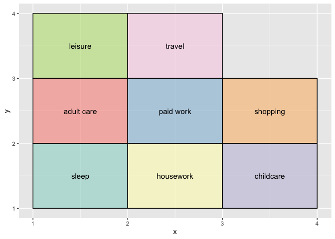<!-- -->

## Defining Sequence Object

Before defining a sequence object, I reduced the dataframe to 2000
sequences. This is because I wanted for the tutorial demostration to run
faster. You can use all sequences as long as they are less than about
46000 in total. On my laptop 46000’s dissimilarity matrix calculation
ran for 4 hours but the cluster analysis crushed. So, I would recommend
to use a random smaller sample if you have huge ones. Or, run the
analyses on chunks and then combine the similar-looking clusters.

``` r
## subsetting is not necessary, but for the sake of efficiency in here I'll subset it to 2000 observations
MyData <- as_tibble(data[1:2000,])


## you want to use the full categories of states:
## (you need to change if you only focus on specific activities)
seq <- seqdef(MyData,
    var = activities,
    cnames = t_intervals_labels,
    alphabet = c("1", "3", "4", "5",
                 "6", "7", "10",
                 "11"), 
    labels = labels,
    cpal = getPalette(colourCount),
    xtstep = 18, ##step between displayed tick-marks and labels on the time x-axis
    id = MyData$id)
## if you have weights then add ===>  weights = MyData$Weight)

## check how the sequence looks like
print(seq[1:5, ], format = "STS")
```

    ##                Sequence                                                                                                                                                                                                                                                                                                                                                                                                                                                                                                                                                                                                                                                                                                                                                                                                                                                                                                                                                                                                                                                                                                                                                                                                                                                                                                                                                                                                                                                                                                                                                                                                                                                                                                                                                                                                                                                                                                                                                                                                                                                                                                                                                                                                                                                                                                                                                                                                                                                                                                                                                                                                                                                                                                                                                                                                                                                                                                                                                                                                                                                                                                                                                                                                                                                                                                                                                                                                                                                                                                                                                                                                                                                                                                                                                                                                                                                                    
    ## 20110101110074 10-10-10-10-10-10-10-10-10-10-3-3-3-3-3-3-3-3-3-3-3-3-3-3-3-3-3-3-3-3-3-3-3-3-3-3-3-3-3-3-3-3-3-3-3-3-3-3-3-3-3-3-3-3-3-3-3-3-3-3-3-3-3-3-3-3-3-3-3-3-3-3-3-3-3-3-3-3-3-3-3-3-3-3-3-3-3-3-3-3-3-3-3-3-3-3-3-3-3-3-3-3-3-3-3-3-3-3-3-3-3-3-3-3-3-3-3-3-3-3-3-3-3-3-3-3-3-3-3-3-3-3-3-3-3-3-3-3-3-3-3-3-3-3-3-3-3-3-3-3-3-3-3-3-3-3-3-3-3-3-3-3-3-3-3-3-3-3-3-3-3-3-3-3-3-3-3-3-3-3-3-3-3-3-3-3-3-3-3-3-3-3-3-3-3-3-3-3-3-3-3-3-3-3-3-3-3-3-3-3-3-3-3-3-3-3-3-3-3-3-3-3-3-3-3-3-3-3-3-3-3-3-3-3-3-3-3-3-3-3-3-3-3-3-3-3-3-3-3-3-3-3-3-3-3-3-3-3-3-3-3-3-3-3-3-3-3-3-3-3-3-3-3-3-3-3-3-3-3-3-3-3-3-3-3-3-3-3-3-3-3-3-3-3-3-3-3-3-3-3-3-3-3-3-3-3-3-3-3-3-11-11-11-11-11-11-11-11-11-11-11-11-11-11-11-11-11-11-11-11-11-11-11-11-11-11-11-11-11-11-11-11-11-11-11-11-11-11-11-11-11-11-11-11-11-11-11-11-11-11-11-11-11-11-11-11-11-11-11-11-11-11-11-11-11-11-11-11-11-11-11-11-11-11-11-11-11-11-11-11-11-11-11-11-11-11-11-11-11-11-11-11-11-11-11-11-11-11-11-11-11-11-11-11-11-11-11-11-11-11-11-11-11-11-11-11-11-11-11-11-11-11-11-11-11-11-11-11-11-11-11-11-11-11-11-11-11-11-11-11-11-11-11-11-11-11-11-11-11-11-11-11-11-11-11-11-11-11-11-11-11-11-11-11-11-11-11-11-11-11-11-11-11-11-11-11-11-11-11-11-11-11-11-11-11-11-11-11-11-11-11-11-11-11-11-11-11-11-11-11-11-11-11-11-11-11-11-11-11-11-11-11-11-11-11-11-11-11-11-11-11-11-11-11-11-11-11-11-11-11-11-11-11-11-11-11-11-11-11-11-11-11-11-11-11-11-11-11-11-11-11-11-11-11-11-11-11-11-11-11-11-11-11-11-11-11-11-11-11-11-11-11-11-11-11-11-11-11-11-11-11-11-11-11-11-11-11-11-11-11-11-11-11-11-11-11-11-11-11-11-11-11-11-11-11-11-11-11-11-11-11-11-11-11-11-11-11-11-11-11-11-11-11-11-11-11-11-11-11-11-11-11-11-11-11-11-11-11-11-11-11-11-11-11-11-11-11-11-11-11-11-11-11-11-11-11-11-11-11-11-11-11-11-11-11-11-11-11-11-11-11-11-11-11-11-11-11-11-11-11-11-11-11-11-11-11-11-11-11-11-11-11-11-11-11-11-11-11-11-11-11-11-11-11-11-11-11-11-11-11-11-11-11-11-11-11-11-11-11-11-11-11-11-11-11-11-11-11-11-11-11-11-11-11-11-11-11-11-11-11-11-11-11-11-11-11-11-11-11-11-11-11-11-11-11-11-11-11-11-11-11-11-11-11-11-11-11-11-11-11-11-11-11-11-11-11-11-11-11-11-11-11-11-11-11-11-11-11-11-11-11-11-11-11-11-11-11-11-11-11-11-11-11-11-11-11-11-11-11-11-11-11-11-11-11-11-11-11-11-11-11-11-11-11-11-11-11-11-11-11-11-11-11-11-11-1-1-1-1-1-1-1-1-1-1-1-1-1-1-1-1-1-1-1-1-1-1-1-1-1-1-1-1-1-1-10-10-10-10-10-10-10-10-10-10-10-10-10-10-10-10-10-10-10-10-10-10-10-10-10-10-10-10-10-10-10-10-10-10-10-10-10-10-10-10-10-10-10-10-10-10-10-10-10-10-10-10-10-10-10-10-10-10-10-10-10-10-10-10-10-10-10-10-10-10-10-10-10-10-10-10-10-10-10-10-10-10-10-10-10-10-10-10-10-10-10-10-10-10-10-10-10-10-10-10-10-10-10-10-10-10-10-10-10-10-10-10-10-10-10-10-10-10-10-10-10-10-10-10-10-10-10-10-10-10-10-10-10-10-10-10-10-10-10-10-10-10-10-10-10-10-10-10-10-10-10-10-10-10-10-10-10-10-10-10-10-10-10-10-10-10-10-10-10-10-10-10-10-10-10-10-10-10-10-10-10-10-10-10-10-10-10-10-10-10-10-10-10-10-10-1-1-1-1-1-1-1-1-1-1-1-1-1-1-1-1-1-1-1-1-1-1-1-1-1-1-1-1-1-1-1-1-1-1-1-1-1-1-1-1-1-1-1-1-1-1-1-1-1-1-1-1-1-1-1-1-1-1-1-1-1-1-1-1-1-1-1-1-1-1-1-1-1-1-1-1-1-1-1-1-1-1-1-1-1-1-1-1-1-1-1-1-1-1-1-1-1-1-1-1-1-1-1-1-1-1-1-1-1-1-1-1-1-1-1-1-1-1-1-1-1-1-1-1-1-1-1-1-1-1-1-1-1-1-1-1-1-1-1-1-1-1-1-1-1-1-1-1-1-1-1-1-1-1-1-1-1-1-1-1-1-1-1-1-1-1-1-1-1-1-1-1-1-1-1-1-1-1-1-1-1-1-1-1-1-1-1-1-1-1-1-1-1-1-1-1-1-1-1-1-1-1-1-1-1-1-1-1-1-1-1-1-1-1-1-1-1-1-1-1-1-1-1-1-1-1-1-1-1-1-1-1-1-1-1-1-1-1-1-1-1-1-1-1-1-1-1-1-1-1-1-1-1-1-1-1-1-1-1-1-1-1-1-1-1-1-1-1-1-1-1-1-1-1-1-1-1-1-1-1-1-1-1-1-1-1-1-1-1-1-1-1-1-1-1-1-1-1-1-1-1-1-1-1-1-1-1-1-1-1-1-1-1-1-1-1-1-1-1-1-1-1-1-1-1-1-1-1-1-1-1-1-1-1-1-1-1-1-1-1-1-1-1-1-1-1-1-1-1-1-1-1-1-1-1-1-1-1-1-1-1-1-1-1-1-1-1-1-1-1                                                                                                         
    ## 20110101110156 1-1-1-1-1-1-1-1-1-1-1-1-1-1-1-1-1-1-1-1-1-1-1-1-1-1-1-1-1-1-1-1-1-1-1-1-1-1-1-1-1-1-1-1-1-1-1-1-1-1-1-1-1-1-1-1-1-1-1-1-1-1-1-1-1-1-1-1-1-1-1-1-1-1-1-1-1-1-1-1-1-1-1-1-1-1-1-1-1-1-1-1-1-1-1-1-1-1-1-1-1-1-1-1-1-1-1-1-1-1-1-1-1-1-1-1-1-1-1-1-1-1-1-1-1-1-1-1-1-1-1-1-1-1-1-1-1-1-1-1-1-1-1-1-1-1-1-1-1-1-1-1-1-1-1-1-1-1-1-1-1-1-1-1-1-1-1-1-1-1-1-1-1-1-1-1-1-1-1-1-1-1-1-1-1-1-1-1-1-1-1-1-1-1-1-1-1-1-1-1-1-1-1-1-1-1-1-1-1-1-1-1-1-1-1-1-1-1-1-1-1-1-1-1-1-1-1-1-1-1-1-1-1-1-1-1-1-1-1-1-3-3-3-3-3-3-3-3-3-3-3-3-3-3-3-3-3-3-3-3-3-3-3-3-3-3-3-3-3-3-3-3-3-3-3-3-3-3-3-3-3-3-3-3-3-3-3-3-3-3-3-3-3-3-3-3-3-3-3-3-3-3-3-3-3-3-3-3-3-3-3-3-3-3-3-3-3-3-3-3-3-3-3-3-3-3-3-3-3-3-3-3-3-3-3-3-3-3-3-3-3-3-3-3-3-3-3-3-3-3-3-3-3-3-3-3-3-3-3-3-3-3-3-3-3-3-3-3-3-3-3-3-3-3-3-3-3-3-3-3-3-3-3-3-3-3-3-3-3-3-3-3-3-3-3-3-3-3-3-3-3-3-3-3-3-3-3-3-3-3-3-3-3-3-3-3-3-3-3-3-3-3-3-3-3-3-3-3-3-3-3-3-3-3-3-3-3-3-3-3-3-3-3-3-3-3-3-3-3-3-3-3-3-3-3-3-3-3-3-3-3-3-3-3-3-3-3-3-3-3-3-3-3-3-3-3-3-3-3-3-3-3-3-3-3-3-3-3-3-3-3-3-3-3-3-3-3-3-3-3-3-3-3-3-3-3-3-3-3-3-3-3-3-3-3-3-3-3-3-3-3-3-3-3-3-3-3-3-3-3-3-3-3-3-3-3-3-3-3-3-11-11-11-11-11-11-11-11-11-11-11-11-11-11-11-11-11-11-11-11-11-11-11-11-11-11-11-11-11-11-10-10-10-10-10-10-10-10-10-10-10-10-10-10-10-10-10-10-10-10-10-10-10-10-10-10-10-10-10-10-10-10-10-10-10-10-10-10-10-10-10-10-10-10-10-10-10-10-10-10-10-10-10-10-10-10-10-10-10-10-10-10-10-10-10-10-10-10-10-10-10-10-10-10-10-10-10-10-10-10-10-10-10-10-10-10-10-10-10-10-10-10-10-10-10-10-10-10-10-10-10-10-10-10-10-10-10-10-10-10-10-10-10-10-10-10-10-10-10-10-10-10-10-10-10-10-10-10-10-10-10-10-10-10-10-10-10-10-10-10-10-10-10-10-10-10-10-10-10-10-10-10-10-10-10-10-10-10-10-10-10-10-10-10-10-10-10-10-10-10-10-10-10-10-10-10-10-10-10-10-10-10-10-10-10-10-10-10-10-10-10-10-10-10-10-10-10-10-10-10-10-10-10-10-10-10-10-10-10-10-10-10-10-10-10-10-10-10-10-10-10-10-10-10-10-10-10-10-10-10-10-10-10-10-10-10-10-10-10-10-10-10-10-10-10-10-10-10-10-10-10-10-10-10-10-10-10-10-10-10-10-10-10-10-10-10-10-10-10-10-11-11-11-11-11-11-11-11-11-11-11-11-11-11-11-10-10-10-10-10-10-10-10-10-10-10-10-10-10-10-10-10-10-10-10-10-10-10-10-10-10-10-10-10-10-10-10-10-10-10-10-10-10-10-10-10-10-10-10-10-10-10-10-10-10-10-10-10-10-10-10-10-10-10-10-11-11-11-11-11-11-11-11-11-11-11-11-11-11-11-10-10-10-10-10-10-10-10-10-10-10-10-10-10-10-10-10-10-10-10-10-10-10-10-10-10-10-10-10-10-10-10-10-10-10-10-10-10-10-10-10-10-10-10-10-10-10-10-10-10-10-10-10-10-10-10-10-10-10-10-10-10-10-10-10-10-10-10-10-10-10-10-10-10-10-10-10-10-10-10-10-10-10-10-10-10-10-10-10-10-10-10-10-10-10-10-10-10-10-10-10-10-10-10-10-10-10-10-10-10-10-10-10-10-10-10-10-10-10-10-10-10-10-10-10-10-10-10-10-10-10-10-10-10-10-10-10-10-10-10-10-10-10-10-10-10-10-10-10-10-10-10-10-10-10-10-10-10-10-10-10-10-10-10-10-10-10-10-10-10-10-10-10-10-10-10-10-10-10-10-10-10-10-10-10-10-10-10-10-10-10-10-10-10-10-10-10-10-10-10-10-10-10-10-10-10-10-10-10-10-1-1-1-1-1-1-1-1-1-1-1-1-1-1-1-1-1-1-1-1-1-1-1-1-1-1-1-1-1-1-1-1-1-1-1-1-1-1-1-1-1-1-1-1-1-1-1-1-1-1-1-1-1-1-1-1-1-1-1-1-1-1-1-1-1-1-1-1-1-1-1-1-1-1-1-1-1-1-1-1-1-1-1-1-1-1-1-1-1-1-1-1-1-1-1-1-1-1-1-1-1-1-1-1-1-1-1-1-1-1-1-1-1-1-1-1-1-1-1-1-1-1-1-1-1-1-1-1-1-1-1-1-1-1-1-1-1-1-1-1-1-1-1-1-1-1-1-1-1-1-1-1-1-1-1-1-1-1-1-1-1-1-1-1-1-1-1-1-1-1-1-1-1-1-1-1-1-1-1-1-1-1-1-1-1-1-1-1-1-1-1-1-1-1-1-1-1-1-1-1-1-1-1-1-1-1-1-1-1-1-1-1-1-1-1-1-1-1-1-1-1-1-1-1-1-1-1-1-1-1-1-1-1-1-1-1-1-1-1-1-1-1-1-1-1-1-1-1-1-1-1-1-1-1-1-1-1-1-1-1-1-1-1-1-1-1-1-1-1-1-1-1-1-1-1-1-1-1-1-1-1-1-1-1-1-1-1-1-1-1-1-1-1-1-1-1-1-1-1-1                                                                                                                                                                                                                                                     
    ## 20110101110507 1-1-1-1-1-1-1-1-1-1-1-1-1-1-1-1-1-1-1-1-1-1-1-1-1-1-1-1-1-1-1-1-1-1-1-1-1-1-1-1-1-1-1-1-1-1-1-1-1-1-1-1-1-1-1-1-1-1-1-1-1-1-1-1-1-1-1-1-1-1-1-1-1-1-1-1-1-1-1-1-1-1-1-1-1-1-1-1-1-1-1-1-1-1-1-1-1-1-1-1-1-1-1-1-1-1-1-1-1-1-1-1-1-1-1-1-1-1-1-1-1-1-1-1-1-1-1-1-1-1-1-1-1-1-1-1-1-1-1-1-1-1-1-1-1-1-1-1-1-1-1-1-1-1-1-1-1-1-1-1-1-1-1-1-1-1-1-1-1-1-1-1-1-1-1-1-1-1-1-1-1-1-1-1-1-1-1-1-1-1-1-1-1-1-1-1-1-1-1-1-1-1-1-1-1-1-1-1-1-1-1-1-1-1-1-1-1-1-1-1-1-1-1-1-1-1-1-1-1-1-1-1-1-1-1-1-1-1-1-1-1-1-1-1-1-1-1-1-1-1-10-10-10-10-10-10-10-10-10-10-10-10-10-10-10-10-10-10-10-10-10-10-10-10-10-10-10-10-10-10-10-10-10-10-10-10-10-10-10-10-10-10-10-10-10-10-10-10-10-10-11-11-5-5-5-5-5-5-5-5-5-5-5-5-5-5-5-5-5-5-5-5-5-5-5-5-5-5-5-5-5-5-5-5-5-5-5-5-5-5-5-5-5-5-5-5-5-5-5-5-5-5-5-5-5-5-5-5-5-5-5-5-11-11-10-10-10-10-10-10-10-10-10-10-10-10-10-10-10-10-10-10-10-10-10-10-10-10-10-10-10-10-10-10-10-10-10-10-10-10-10-10-10-10-10-10-10-10-10-10-10-10-10-10-10-10-10-10-10-10-10-10-10-10-10-10-10-10-10-10-10-10-10-10-10-10-10-10-10-10-10-10-10-10-10-10-10-10-10-10-10-10-10-10-10-10-10-10-10-10-10-10-10-10-10-10-10-10-10-10-10-10-10-10-10-10-10-10-10-10-10-10-10-10-10-10-10-10-10-10-10-10-10-10-10-10-10-10-10-10-10-10-10-10-10-10-10-10-10-10-10-10-10-10-1-1-1-1-1-1-1-1-1-1-1-1-1-1-1-1-1-1-1-1-1-1-1-1-1-1-11-11-10-10-10-10-10-10-10-10-10-10-11-11-11-11-11-11-11-11-11-11-11-11-11-11-11-7-7-7-7-7-11-11-11-11-11-11-11-11-11-11-11-11-11-11-11-3-3-3-3-3-11-11-10-10-10-10-10-10-10-10-10-10-10-10-10-10-10-10-10-10-10-10-10-10-10-10-10-10-10-10-10-10-10-10-10-10-10-10-10-10-10-10-10-10-10-10-10-10-10-10-10-10-10-10-10-10-10-10-10-10-10-10-10-10-10-10-10-10-10-10-10-10-10-10-10-10-10-10-10-10-10-10-10-10-10-10-10-10-10-10-10-10-10-10-10-10-10-10-10-10-10-10-10-10-10-10-10-10-10-10-10-10-10-10-10-10-10-10-10-10-10-10-10-10-10-10-10-10-10-10-10-10-10-10-10-10-10-10-10-10-10-10-10-10-10-10-10-10-10-10-10-10-10-10-10-10-10-10-10-10-10-10-10-10-10-10-10-10-10-10-10-10-10-10-10-10-10-10-10-10-10-10-10-10-10-10-10-10-10-10-10-10-10-10-10-10-10-10-10-10-10-10-10-10-10-10-10-10-10-10-10-10-10-10-10-10-10-10-10-10-10-10-10-10-10-10-10-10-10-10-10-10-10-10-10-10-10-10-10-10-10-10-10-10-10-10-10-10-10-10-10-10-10-10-10-10-10-10-10-10-10-10-10-10-10-10-10-10-10-10-10-10-10-10-10-10-10-10-10-10-10-10-10-10-10-10-10-10-10-10-10-10-10-10-10-10-10-10-10-10-10-10-10-10-10-10-10-10-10-10-10-10-10-10-10-10-10-10-10-10-10-10-10-10-10-10-10-10-10-10-10-10-10-10-10-10-10-10-10-10-10-10-10-10-10-10-10-10-10-10-10-10-10-10-10-10-10-10-10-10-10-10-10-10-10-10-10-10-10-10-10-10-10-10-10-10-10-10-10-10-10-10-10-10-10-10-10-10-10-10-10-10-10-10-10-10-10-10-10-10-10-10-10-10-10-10-10-10-10-10-10-10-10-10-10-10-10-10-10-10-10-10-10-10-10-10-10-10-11-11-5-5-5-5-5-5-5-5-5-5-11-11-1-1-1-1-1-1-1-1-1-1-1-1-1-1-1-1-1-1-1-1-1-1-1-1-1-1-1-1-1-1-1-1-1-1-1-1-1-1-1-1-1-1-1-1-1-1-1-1-1-1-1-1-1-1-1-1-1-1-1-1-1-1-1-1-1-1-1-1-1-1-1-1-1-1-1-1-1-1-1-1-1-1-1-1-1-1-1-1-1-1-1-1-1-1-1-1-1-1-1-1-1-1-1-1-1-1-1-1-1-1-1-1-1-1-1-1-1-1-1-1-1-1-1-1-1-1-1-1-1-1-1-1-1-1-1-1-1-1-1-1-1-1-1-1-1-1-1-1-1-1-1-1-1-1-1-1-1-1-1-1-1-1-1-1-1-1-1-1-1-1-1-1-1-1-1-1-1-1-1-1-1-1-1-1-1-1-1-1-1-1-1-1-1-1-1-1-1-1-1-1-1-1-1-1-1-1-1-1-1-1-1-1-1-1-1-1-1-1-1-1-1-1-1-1-1-1-1-1-1-1-1-1-1-1-1-1-1-1-1-1-1-1-1-1-1-1-1-1-1-1-1-1-1-1-1-1-1-1-1-1-1-1-1-1-1-1-1-1-1-1-1-1-1-1-1-1-1-1-1-1-1-1-1-1-1-1-1-1-1-1-1-1-1-1-1-1-1-1-1-1-1-1-1-1-1-1-1-1-1-1-1-1-1-1-1-1-1-1-1-1-1-1-1-1-1-1-1-1-1-1-1-1-1-1-1-1-1-1-1-1-1-1-1-1-1-1-1-1-1-1-1-1-1-1-1-1-1-1-1-1-1-1-1-1-1-1-1-1-1-1-1-1-1-1-1-1-1-1-1-1-1-1-1-1-1-1-1-1-1-1-1-1-1-1-1-1-1-1-1-1-1-1-1-1-1-1                                                                                                                                                                       
    ## 20110101110521 10-10-10-10-10-10-10-10-10-10-10-10-10-10-10-10-10-10-10-10-10-10-10-10-10-10-10-10-10-10-10-10-10-10-10-10-10-10-10-10-10-10-10-10-10-10-10-10-10-10-10-10-10-10-10-10-10-10-10-10-10-10-10-10-10-10-10-10-10-10-10-10-10-10-10-10-10-10-10-10-10-10-10-10-10-10-10-10-10-10-10-10-10-10-10-10-10-10-10-10-10-10-10-10-10-10-10-10-10-10-10-10-10-10-10-10-10-10-10-10-10-10-10-10-10-10-10-10-10-10-10-10-10-10-10-10-10-10-10-10-10-10-10-10-10-10-10-10-10-10-10-10-10-10-10-10-10-10-10-10-10-10-10-10-10-10-10-10-10-10-10-10-10-10-10-10-10-10-10-10-3-3-3-3-3-3-3-3-3-3-3-3-3-3-3-3-3-3-3-3-3-3-3-3-3-3-3-3-3-3-3-3-3-3-3-3-3-3-3-3-3-3-3-3-3-3-3-3-3-3-3-3-3-3-3-3-3-3-3-3-10-10-10-10-10-10-10-10-10-10-10-10-10-10-10-10-10-10-10-10-10-10-10-10-10-10-10-10-10-10-10-10-10-10-10-10-10-10-10-10-10-10-10-10-10-10-10-10-10-10-10-10-10-10-10-10-10-10-10-10-10-10-10-10-10-10-10-10-10-10-10-10-10-10-10-10-10-10-10-10-10-10-10-10-10-10-10-10-10-10-10-10-10-10-10-10-10-10-10-10-10-10-10-10-10-10-10-10-10-10-10-10-10-10-10-10-10-10-10-10-10-10-10-10-10-10-10-10-10-10-10-10-10-10-10-10-10-10-10-10-10-10-10-10-10-10-10-10-10-10-10-10-10-10-10-10-10-10-10-10-10-10-10-10-10-10-10-10-10-10-10-10-10-10-10-10-10-10-10-10-11-11-11-11-11-11-11-11-11-11-11-11-11-11-11-11-11-11-11-11-11-11-11-11-11-11-11-11-11-11-10-10-10-10-10-10-10-10-10-10-10-10-10-10-10-10-10-10-10-10-10-10-10-10-10-10-10-10-10-10-10-10-10-10-10-10-10-10-10-10-10-10-10-10-10-10-10-10-10-10-10-10-10-10-10-10-10-10-10-10-10-10-10-10-10-10-10-10-10-10-10-10-10-10-10-10-10-10-10-10-10-10-10-10-10-10-10-10-10-10-10-10-10-10-10-10-10-10-10-10-10-10-10-10-10-10-10-10-10-10-10-10-10-10-10-10-10-10-10-10-11-11-11-11-11-11-11-11-11-11-11-11-11-11-11-11-11-11-11-11-11-11-11-11-11-11-11-11-11-11-1-1-1-1-1-1-1-1-1-1-1-1-1-1-1-1-1-1-1-1-1-1-1-1-1-1-1-1-1-1-3-3-3-3-3-3-3-3-3-3-3-3-3-3-3-3-3-3-3-3-3-3-3-3-3-3-3-3-3-3-10-10-10-10-10-10-10-10-10-10-10-10-10-10-10-10-10-10-10-10-10-10-10-10-10-10-10-10-10-10-10-10-10-10-10-10-10-10-10-10-10-10-10-10-10-10-10-10-10-10-10-10-10-10-10-10-10-10-10-10-10-10-10-10-10-10-10-10-10-10-10-10-10-10-10-10-10-10-10-10-10-10-10-10-10-10-10-10-10-10-10-10-10-10-10-10-10-10-10-10-10-10-10-10-10-10-10-10-10-10-10-10-10-10-10-10-10-10-10-10-10-10-10-10-10-10-10-10-10-10-10-10-10-10-10-10-10-10-10-10-10-10-10-10-10-10-10-10-10-10-10-10-10-10-10-10-10-10-10-10-10-10-10-10-10-10-10-10-10-10-10-10-10-10-10-10-10-10-10-10-10-10-10-10-10-10-10-10-10-10-10-10-10-10-10-10-10-10-10-10-10-10-10-10-10-10-10-10-10-10-1-1-1-1-1-1-1-1-1-1-1-1-1-1-1-1-1-1-1-1-1-1-1-1-1-1-1-1-1-1-10-10-10-10-10-10-10-10-10-10-10-10-10-10-10-10-10-10-10-10-10-10-10-10-10-10-10-10-10-10-10-10-10-10-10-10-10-10-10-10-10-10-10-10-10-10-10-10-10-10-10-10-10-10-10-10-10-10-10-10-1-1-1-1-1-1-1-1-1-1-1-1-1-1-1-1-1-1-1-1-1-1-1-1-1-1-1-1-1-1-1-1-1-1-1-1-1-1-1-1-1-1-1-1-1-1-1-1-1-1-1-1-1-1-1-1-1-1-1-1-1-1-1-1-1-1-1-1-1-1-1-1-1-1-1-1-1-1-1-1-1-1-1-1-1-1-1-1-1-1-1-1-1-1-1-1-1-1-1-1-1-1-1-1-1-1-1-1-1-1-1-1-1-1-1-1-1-1-1-1-1-1-1-1-1-1-1-1-1-1-1-1-1-1-1-1-1-1-1-1-1-1-1-1-1-1-1-1-1-1-1-1-1-1-1-1-1-1-1-1-1-1-1-1-1-1-1-1-1-1-1-1-1-1-1-1-1-1-1-1-1-1-1-1-1-1-1-1-1-1-1-1-1-1-1-1-1-1-1-1-1-1-1-1-1-1-1-1-1-1-1-1-1-1-1-1-1-1-1-1-1-1-1-1-1-1-1-1-1-1-1-1-1-1-1-1-1-1-1-1-1-1-1-1-1-1-1-1-1-1-1-1-1-1-1-1-1-1-1-1-1-1-1-1-1-1-1-1-1-1-1-1-1-1-1-1-1-1-1-1-1-1-1-1-1-1-1-1-1-1-1-1-1-1-1-1-1-1-1-1-1-1-1-1-1-1-1-1-1-1-1-1-1-1-1-1-1-1-1-1-1-1-1-1-1-1-1-1-1-1-1-1-1-1-1-1-1-1-1-1-1-1-1-1-1-1-1-1-1-1-1-1-1-1-1-1-1-1-1-1-1-1-1-1-1-1-1-1-1-1-1-1-1-1-1-1-1-1-1-1-1-1-1-1-1-1-1-1-1-1-1-1-1-1-1-1-1-1-1-1-1-1-1-1-1-1-1-1-1-1-1-1-1-1-1-1-1-1-1-1-1-1-1-1-1-1-1-1-1-1-1-1-1-1-1-1-1-1-1-1-1-1-1-1-1-1-1-1-1-1-1-1-1-1-1-1-1-1-1-1-1-1-1-1-1-1-1-1-1-1-1-1-1-1-1-1-1-1-1-1                                   
    ## 20110101110522 1-1-1-1-1-1-1-1-1-1-1-1-1-1-1-1-1-1-1-1-1-1-1-1-1-1-1-1-1-1-1-1-1-1-1-1-1-1-1-1-1-1-1-1-1-1-1-1-1-1-1-1-1-1-1-1-1-1-1-1-1-1-1-1-1-1-1-1-1-1-1-1-1-1-1-1-1-1-1-1-1-1-1-1-1-1-1-1-1-1-1-1-1-1-1-1-1-1-1-1-1-1-1-1-1-1-1-1-1-1-1-1-1-1-1-1-1-1-1-1-1-1-1-1-1-1-1-1-1-1-1-1-1-1-1-1-1-1-1-1-1-1-1-1-1-1-1-1-1-1-1-1-1-1-1-1-1-1-1-1-1-1-1-1-1-1-1-1-1-1-1-1-1-1-1-1-1-1-1-1-1-1-1-1-1-1-1-1-1-1-1-1-1-1-1-1-1-1-1-1-1-1-1-1-1-1-1-1-1-1-1-1-1-1-1-1-1-1-1-1-1-1-1-1-1-1-1-1-1-1-1-1-1-1-1-1-1-1-1-1-3-3-3-3-3-1-1-1-1-1-1-1-1-1-1-1-1-1-1-1-10-10-10-10-10-10-10-10-10-10-10-10-10-10-10-10-10-10-10-10-10-10-10-10-10-10-10-10-10-10-10-10-10-10-10-10-10-10-10-10-10-10-10-10-10-10-10-10-10-10-10-10-10-10-10-10-10-10-10-10-10-10-10-10-10-10-10-10-10-10-10-10-10-10-10-10-10-10-10-10-10-10-10-10-10-10-10-10-10-10-10-10-10-10-10-10-10-10-10-10-10-10-10-10-10-10-10-10-10-10-10-10-10-10-10-10-10-10-10-10-10-10-10-10-10-10-10-10-10-10-10-10-10-10-10-10-10-10-10-10-10-10-10-10-10-10-10-10-10-10-10-10-10-10-10-10-10-10-10-10-10-10-10-10-10-10-10-10-10-10-10-10-10-10-10-10-10-10-10-10-10-10-10-10-10-10-10-10-10-10-10-10-10-10-10-10-10-10-10-10-10-10-10-10-10-10-10-10-10-10-10-10-10-10-10-10-10-10-10-10-10-10-10-10-10-10-10-10-10-10-10-10-10-10-10-10-10-10-10-10-10-10-10-10-10-10-10-10-10-10-10-10-10-10-10-3-3-3-3-3-3-3-3-3-3-3-3-3-3-3-3-3-3-3-3-3-3-3-3-3-3-3-3-3-3-10-10-10-10-10-10-10-10-10-10-10-10-10-10-10-10-10-10-10-10-10-10-10-10-10-10-10-10-10-10-10-10-10-10-10-10-10-10-10-10-10-10-10-10-10-10-10-10-10-10-10-10-10-10-10-10-10-10-10-10-10-10-10-10-10-10-10-10-10-10-10-10-10-10-10-10-10-10-10-10-10-10-10-10-10-10-10-10-10-10-10-10-10-10-10-10-10-10-10-10-11-11-11-11-11-11-11-11-11-11-11-11-11-11-11-11-11-11-11-11-11-11-11-11-11-11-11-11-11-11-4-11-11-11-11-11-11-11-11-11-11-11-11-11-11-11-11-11-11-11-11-11-11-11-11-11-11-11-11-11-11-11-11-11-11-11-11-11-11-11-11-11-11-11-11-11-11-11-11-11-11-11-11-11-11-11-11-11-11-11-11-11-11-11-11-11-11-11-11-11-11-11-11-11-11-11-11-11-11-11-11-11-11-11-11-11-11-11-11-11-11-11-11-11-11-11-11-11-11-11-11-11-11-11-11-11-4-4-4-4-4-4-4-4-4-4-4-4-4-4-4-4-4-4-4-4-4-4-4-4-4-4-4-4-4-4-11-11-11-11-11-11-11-11-11-11-11-11-11-11-11-11-11-11-11-11-10-10-10-10-10-10-10-10-10-10-10-10-10-10-10-10-10-10-10-10-10-10-10-10-10-10-10-10-10-10-10-10-10-10-10-10-10-10-10-10-10-10-10-10-10-10-10-10-10-10-10-10-10-10-10-10-10-10-10-10-11-11-11-11-11-11-11-11-11-11-11-11-11-11-11-11-11-11-11-11-11-11-11-11-11-11-11-11-11-11-11-11-11-11-11-11-11-11-11-11-11-11-11-11-11-11-11-11-11-11-11-11-11-11-11-11-11-11-11-11-4-4-4-4-4-11-11-11-11-11-11-11-11-11-11-11-11-11-11-11-11-11-11-11-11-10-10-10-10-10-10-10-10-10-10-10-10-10-10-10-10-10-10-10-10-10-10-10-10-10-10-10-10-10-10-10-10-10-10-10-10-10-10-10-10-10-10-10-10-10-10-10-10-10-10-10-10-10-10-10-10-10-10-10-10-10-10-10-10-10-10-10-10-10-10-10-10-10-10-10-10-10-10-10-10-10-10-10-10-10-10-10-10-10-10-10-10-10-10-10-10-10-10-10-10-10-10-10-10-10-10-10-10-10-10-10-10-10-10-10-10-10-10-10-10-10-10-10-10-10-10-10-10-10-10-10-10-10-10-10-10-10-10-10-10-10-10-10-10-10-10-10-10-10-10-10-10-10-10-10-10-10-10-10-10-10-10-10-10-10-10-10-10-10-10-10-10-10-10-10-10-10-10-10-10-10-10-10-10-10-10-10-10-10-10-10-10-10-10-10-1-1-1-1-1-1-1-1-1-1-1-1-1-1-1-1-1-1-1-1-1-1-1-1-1-1-1-1-1-1-1-1-1-1-1-1-1-1-1-1-1-1-1-1-1-1-1-1-1-1-1-1-1-1-1-1-1-1-1-1-1-1-1-1-1-1-1-1-1-1-1-1-1-1-1-1-1-1-1-1-1-1-1-1-1-1-1-1-1-1-1-1-1-1-1-1-1-1-1-1-1-1-1-1-1-1-1-1-1-1-1-1-1-1-1-1-1-1-1-1-1-1-1-1-1-1-1-1-1-1-1-1-1-1-1-1-1-1-1-1-1-1-1-1-1-1-1-1-1-1-1-1-1-1-1-1-1-1-1-1-1-1-1-1-1-1-1-1-1-1-1-1-1-1-1-1-1-1-1-1-1-1-1-1-1-1-1-1-1-1-1-1-1-1-1-1-1-1-1-1-1-1-1-1-1-1-1-1-1-1-1-1-1-1-1-1-1-1-1-1-1-1-1-1-1-1-1-1-1-1-1-1-1-1-1-1-1-1-1-1-1-1-1-1-1-1-1-1-1-1-1-1-1-1-1-1-1-1-1-1-1-1-1-1-1-1-1-1-1

``` r
## "STS" format shows each step
```

## Plotting Sequences

-   sequence index plots

With a small i, the default for idxs is 1:10, plotting the first 10
sequences. If you set idxs to 0, it plots all sequences (might take a
long time).

``` r
seqiplot(seq, border = NA, with.legend = "right", legend.prop=0.4)
```

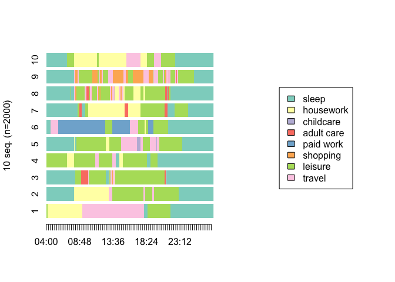<!-- -->

You can also use the same command with a capital I. It wiil plot all
unless you specify idxs option.

``` r
seqIplot(seq, border = NA, with.legend = "right", legend.prop=0.4, idxs = 1:4)
```

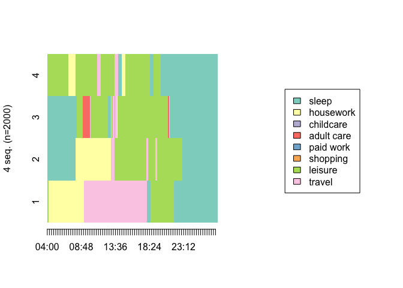<!-- -->

-   the most frequent sequences

Unfortunately, for time-use data, it is usually useless to plot the most
frequent sequences. If you tabulate 4 frequent sequences you will see
what I mean. It is because there are 1440 steps and there are barely any
same sequences. This command is more useful for shorter sequences with
many commonalities (as in life-course research).

``` r
## tabulate 4 frequent sequences:
## because there are 1440 steps there are barely any
## this is more useful for shorter sequences with many commonalities (as in life-course research)
seqtab(seq, idxs = 1:4)
```

    ##                                                                                                                                                   Freq
    ## 1/1-10/209-1/45-11/15-10/240-11/6-7/10-11/12-1/180-3/30-4/212-10/180-1/300                                                                           1
    ## 1/1-10/60-3/30-10/110-3/35-10/10-3/150-11/20-7/60-11/20-3/150-11/5-6/249-11/5-10/110-1/425                                                           1
    ## 1/1-10/60-3/30-10/30-3/60-11/5-10/60-11/5-1/30-11/5-7/5-11/5-7/40-11/5-7/10-11/5-7/60-10/120-11/10-10/60-3/10-10/15-1/90-10/180-3/25-10/255-1/259    1
    ## 1/10-3/2-10/108-1/30-11/5-5/1-11/3-10/321-11/3-5/1-11/4-6/322-11/2-10/30-11/6-10/97-1/495                                                            1
    ##                                                                                                                                                   Percent
    ## 1/1-10/209-1/45-11/15-10/240-11/6-7/10-11/12-1/180-3/30-4/212-10/180-1/300                                                                           0.05
    ## 1/1-10/60-3/30-10/110-3/35-10/10-3/150-11/20-7/60-11/20-3/150-11/5-6/249-11/5-10/110-1/425                                                           0.05
    ## 1/1-10/60-3/30-10/30-3/60-11/5-10/60-11/5-1/30-11/5-7/5-11/5-7/40-11/5-7/10-11/5-7/60-10/120-11/10-10/60-3/10-10/15-1/90-10/180-3/25-10/255-1/259    0.05
    ## 1/10-3/2-10/108-1/30-11/5-5/1-11/3-10/321-11/3-5/1-11/4-6/322-11/2-10/30-11/6-10/97-1/495                                                            0.05

``` r
##also can plot frequencies using seqfplot
seqfplot(seq, border = NA, with.legend = "right", legend.prop=0.4)
```

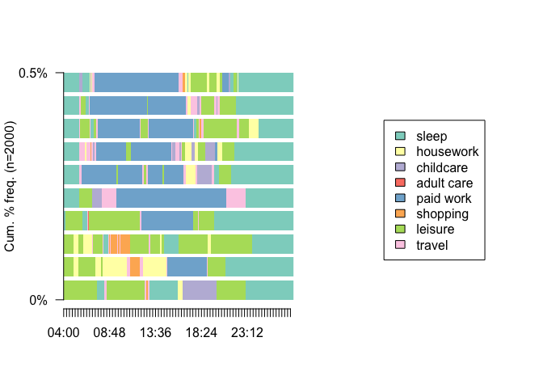<!-- -->

-   tempograms

State distribution plots (aka tempogram aka chronogram) This is an easy
way to plot a tempogram (compared to area plots).

``` r
## this is an easy way to plot a tempogram 
seqdplot(seq, border = NA, with.legend = "right", legend.prop=0.4)
```

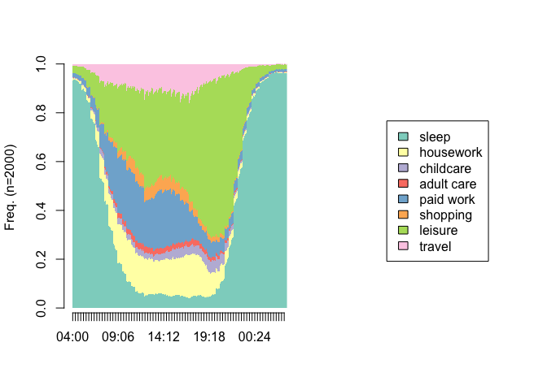<!-- -->

## Transitions

``` r
# transitions from state to state (in probabilities)
trate <- seqtrate(seq)
```

    ##  [>] computing transition probabilities for states 1/3/4/5/6/7/10/11 ...

``` r
round(trate, 2)
```

    ##         [-> 1] [-> 3] [-> 4] [-> 5] [-> 6] [-> 7] [-> 10] [-> 11]
    ## [1 ->]       1   0.00   0.00   0.00   0.00   0.00    0.00    0.00
    ## [3 ->]       0   0.98   0.00   0.00   0.00   0.00    0.01    0.00
    ## [4 ->]       0   0.00   0.97   0.00   0.00   0.00    0.01    0.01
    ## [5 ->]       0   0.00   0.00   0.98   0.00   0.00    0.00    0.01
    ## [6 ->]       0   0.00   0.00   0.00   0.99   0.00    0.00    0.00
    ## [7 ->]       0   0.00   0.00   0.00   0.00   0.97    0.00    0.03
    ## [10 ->]      0   0.00   0.00   0.00   0.00   0.00    0.99    0.00
    ## [11 ->]      0   0.01   0.00   0.00   0.00   0.01    0.02    0.95

``` r
## heatmap of the transitions matrix
heatTrate=melt(trate)
head(heatTrate)
```

    ##     Var1   Var2        value
    ## 1 [1 ->] [-> 1] 9.962543e-01
    ## 2 [3 ->] [-> 1] 2.178463e-03
    ## 3 [4 ->] [-> 1] 3.259718e-03
    ## 4 [5 ->] [-> 1] 1.190891e-03
    ## 5 [6 ->] [-> 1] 3.979046e-04
    ## 6 [7 ->] [-> 1] 6.193964e-05

``` r
## plot the heatmap
ggplot(heatTrate, aes(Var2, Var1)) +
  geom_tile(aes(fill = value)) +
  geom_text(aes(label = round(value, 2))) +
  scale_fill_continuous(high = "#132B43", low = "#56B1F7", name="Transitions")
```

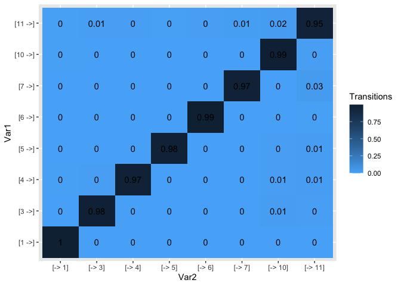<!-- -->

## Changing Granularity (Minutes to Hours, etc.)

TraMineR made it very easy to change the number of steps in a sequence.
*seqgranularity* is the command that will help you do it.

To use the first state to represent all, use method = “first”, the last
= “last”, or the most frequent = “mostfreq”.

In the following chunk of code, tspan = 15 means to transform the step
to every 15 min (instead of every minute).

``` r
time15_seq <- seqgranularity(seq, tspan=15, method="mostfreq")

## plot the tempogram
seqdplot(time15_seq, border = NA, with.legend = "right", legend.prop=0.4)
```

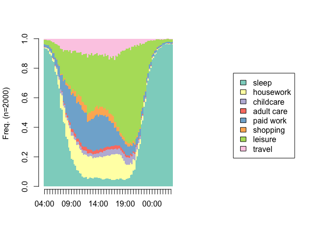<!-- -->

You can see on the tempograms that the granularity decreased and now
each step is a 15-minute slot.

## Modal states sequence

``` r
#seqplot(time15_seq, type="ms", with.legend = "right", legend.prop=0.4)
## same as
seqmsplot(time15_seq, with.legend = "right", legend.prop=0.4, main="Modal Sequences")
```

<!-- -->

## Embrace entropy

The higher the value, the more diverse are activities at that time.

``` r
#transversal entropy of state distributions
#the number of valid states and the Shannon entropy of the transversal state distribution
# shows the measure of 'chaos' (diversity of activities) in the diaries
seqHtplot(time15_seq, with.legend = "right", legend.prop=0.4)
```

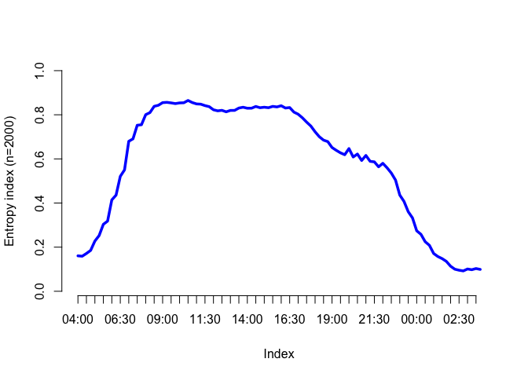<!-- -->

## Calculating Dissimilarities

## Substitution Cost Matrix

We need to define the substitution cost for all the transitions (it can
be a constant or user-defined).

``` r
# seqdist() = for pairwise dissimilarities
# seqsubm() = to compute own substitution matrix
#"TRATE" option, the costs are determined from the estimated transition rates
scost <- seqsubm(time15_seq, method = "TRATE")
```

    ##  [>] creating substitution-cost matrix using transition rates ...

    ##  [>] computing transition probabilities for states 1/3/4/5/6/7/10/11 ...

``` r
round(scost, 3)
```

    ##        1->   3->   4->   5->   6->   7->  10->  11->
    ## 1->  0.000 1.962 1.953 1.984 1.992 1.995 1.927 1.956
    ## 3->  1.962 0.000 1.929 1.970 1.987 1.963 1.824 1.904
    ## 4->  1.953 1.929 0.000 1.995 1.988 1.990 1.906 1.906
    ## 5->  1.984 1.970 1.995 0.000 1.995 1.991 1.934 1.898
    ## 6->  1.992 1.987 1.988 1.995 0.000 1.993 1.952 1.919
    ## 7->  1.995 1.963 1.990 1.991 1.993 0.000 1.949 1.729
    ## 10-> 1.927 1.824 1.906 1.934 1.952 1.949 0.000 1.769
    ## 11-> 1.956 1.904 1.906 1.898 1.919 1.729 1.769 0.000

``` r
## calculated in this way, all are close to 2 anyway (for this dataset) 2 is default
## or we can use the usual default one of constant 2:
ccost <- seqsubm(time15_seq, method="CONSTANT", cval=2)
```

    ##  [>] creating 8x8 substitution-cost matrix using 2 as constant value

``` r
round(ccost, 3)
```

    ##      1-> 3-> 4-> 5-> 6-> 7-> 10-> 11->
    ## 1->    0   2   2   2   2   2    2    2
    ## 3->    2   0   2   2   2   2    2    2
    ## 4->    2   2   0   2   2   2    2    2
    ## 5->    2   2   2   0   2   2    2    2
    ## 6->    2   2   2   2   0   2    2    2
    ## 7->    2   2   2   2   2   0    2    2
    ## 10->   2   2   2   2   2   2    0    2
    ## 11->   2   2   2   2   2   2    2    0

## Optimal Matching

Optimal matching for calculating dissimilarities between sequences need
the specification of both substitution and indel costs. The algorithm is
developed by Needleman and Wunsch (1970). For the illustration how the
algorithm works please link to [my explanation of optimal
matching](https://blogs.ubc.ca/kamilakolpashnikova/optimal-matching-algorithm-interactive-app-for-social-scientists/)

If the sequence file is heavy, calculate only the upper part of the
matrix by full.matrix = FALSE The usual default is that substitution
cost is twice the indel cost, and default indel cost is 1.

``` r
om_time <- seqdist(time15_seq, method = "OM", indel = 1, sm = scost)
```

    ##  [>] 2000 sequences with 8 distinct states

    ##  [>] checking 'sm' (size and triangle inequality)

    ##  [>] 2000 distinct  sequences

    ##  [>] min/max sequence lengths: 96/96

    ##  [>] computing distances using the OM metric

    ##  [>] elapsed time: 27.877 secs

``` r
## this results in a dissimilarity matrix which you can look at using:
round(om_time[1:10, 1:10], 1)
```

    ##        [,1]  [,2]  [,3]  [,4] [,5]  [,6]  [,7] [,8]  [,9] [,10]
    ##  [1,]   0.0  72.6 102.9  87.5 86.5  93.1  86.3 95.7 106.2  63.8
    ##  [2,]  72.6   0.0  46.4  67.4 48.6 102.1  46.0 49.1  70.4  53.0
    ##  [3,] 102.9  46.4   0.0  51.2 39.5  93.8  72.9 36.1  72.7  81.3
    ##  [4,]  87.5  67.4  51.2   0.0 64.2  93.7  99.0 63.4 100.3  88.5
    ##  [5,]  86.5  48.6  39.5  64.2  0.0  97.3  73.2 50.3  58.3  66.0
    ##  [6,]  93.1 102.1  93.8  93.7 97.3   0.0 116.3 86.9 111.2 100.6
    ##  [7,]  86.3  46.0  72.9  99.0 73.2 116.3   0.0 66.4  87.1  45.1
    ##  [8,]  95.7  49.1  36.1  63.4 50.3  86.9  66.4  0.0  66.4  68.0
    ##  [9,] 106.2  70.4  72.7 100.3 58.3 111.2  87.1 66.4   0.0  87.9
    ## [10,]  63.8  53.0  81.3  88.5 66.0 100.6  45.1 68.0  87.9   0.0

## Cluster Analysis

Let’s run cluster analysis on our dissimilarity matrix

Other common methods are:

-   “average”,
-   “single”,
-   “complete”

The “average” and “single” options do not work well for time-use data
(check). The “complete” option is a possibility (check).

``` r
## run cluster analysis on the calculated dissimilarity matrix
clusterward <- agnes(om_time, diss = TRUE, method = "ward")
## other common methods are "average", "single", "complete" (instead of "ward")  
## "average" and "single" do not work well for time-use data (check if you want)
## "complete" can be an option
## "ward" is the "industry standard"

# Convert hclust into a dendrogram and plot
hcd <- as.dendrogram(clusterward)

# plot the dendrogram
plot(hcd, type = "rectangle", ylab = "Height")
```

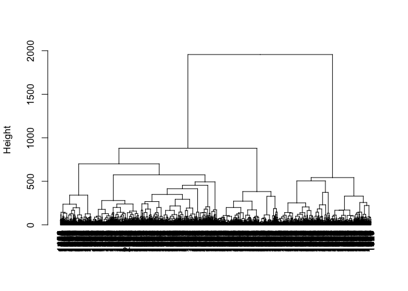<!-- -->

## How good is our clustering?

Let’s inspect the splitting tree branches:

``` r
#inspect the splitting steps
ward.tree <- as.seqtree(clusterward, seqdata = time15_seq, 
                            diss = om_time, 
                            ncluster = 25)
## plot the tree of tempograms to check how it splits the diaries
seqtreedisplay(ward.tree, type = "d", border = NA, show.depth = TRUE) 
```

Test the cluster solution quality:

There are many possible tests:

-   PBC. Point Biserial Correlation. Correlation between the given
    distance matrice and a distance which equal to zero for individuals
    in the same cluster and one otherwise.
-   HG. Hubert’s Gamma. Same as previous but using Kendall’s Gamma
    coefficient.
-   HGSD. Hubert’s Gamma (Somers’D). Same as previous but using Somers’
    D coefficient.
-   ASW. Average Silhouette width (observation).
-   ASWw. Average Silhouette width (weighted).
-   CH. Calinski-Harabasz index (Pseudo F statistics computed from
    distances).
-   R2. Share of the discrepancy explained by the clustering solution.
-   CHsq. Calinski-Harabasz index (Pseudo F statistics computed from
    squared distances).
-   R2sq. Share of the discrepancy explained by the clustering solution
    (computed using squared distances).
-   HC. Hubert’s C coefficient.
-   ASW. The Average Silhouette Width of each cluster, one column for
    each ASW measure.

``` r
#test cluster solution quality
wardtest <- as.clustrange(clusterward,
                         diss = om_time, 
                          ncluster = 25)

#plot the quality criteria
plot(wardtest, stat = c("ASW", "HC", "PBC"), norm = "zscore", lwd = 4)
```

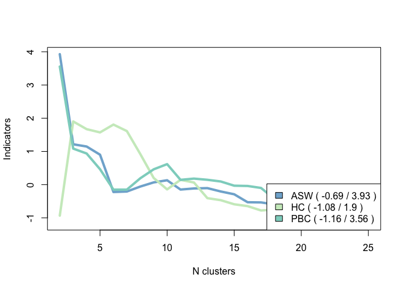<!-- -->

Let’s say that our solution is pretty good for 8 clusters.

1.  Cut the tree

``` r
c8 <- cutree(clusterward, k = 8)

## bind with the dataset
MyData<-cbind(MyData, c8)
```

2.  Plot the cluster solution (will save in the working directory)

``` r
#plot cluster solution
png("plot_clusters.png", 1200, 800)
seqdplot(time15_seq, group = c8, border = NA)
dev.off()
```

    ## quartz_off_screen 
    ##                 2

## How to plot a cluster

``` r
# subset data by cluster
cl1<-(time15_seq[MyData$c8 ==  "1",])

# plot the selected cluster 
par(mfrow=c(1,1))
seqdplot(cl1, main = "",
         cex.main = 1.7, 
         with.legend = FALSE, 
         yaxis = FALSE, 
         cpal = getPalette(colourCount), 
         ylab = "",
         border = NA)
```

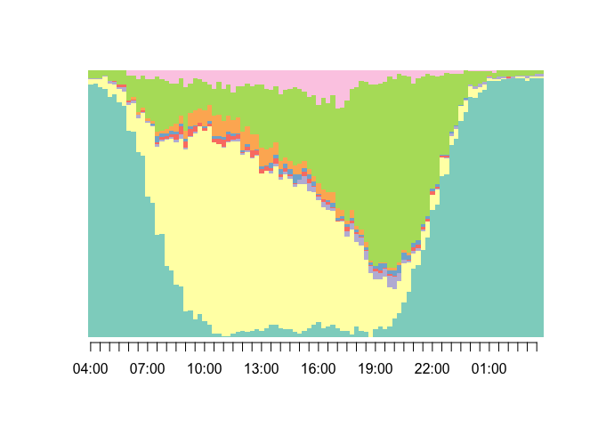<!-- -->

``` r
## write new data to csv if needed
#write.csv(MyData, "clustered_EC.csv")
```

[1] University of Oxford
